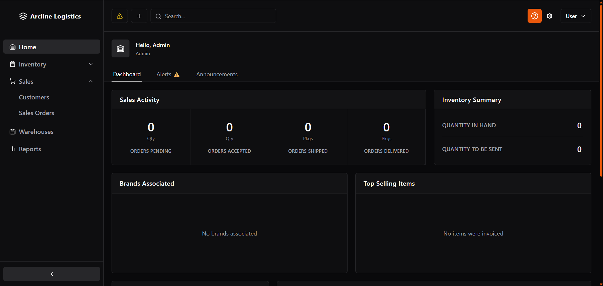
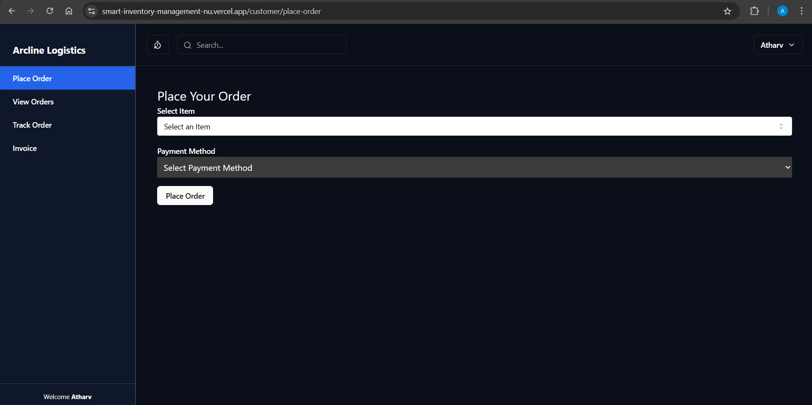

***Smart Inventory Management System***
**WORK IN PROGRESS**

Tailored for e-commerce companies, this solution is versatile enough to meet the needs of any business requiring meticulous stock control and customer-facing functionality. Explore the power of our product to streamline operations—from managing internal inventory to delivering a seamless purchasing experience for end users. It offers a comprehensive system to oversee stock, optimize business processes, and support customer interactions such as placing orders, tracking deliveries, and accessing invoices.

This project demonstrates a robust full-stack architecture with a wide range of advanced features and best practices, including:
1. Modern, intuitive user interface
2. Appropriate server-side and client-side rendering
3. Advanced authentication, including:
  • JWT and HTTP-Only Cookies
  • Authentication with email and password
  • Email verification functionality
  • Password reset and update functionality
4. Serverless PostgreSQL database conenction and Neon Cloud 
5. Complex ralations between database models
6. Prepared statements for fast SQL execution
7. Relevant CRUD operations
8. Reports and Analytics
9. Effectively handles problem of understocking & overstocking
10. Customer portal for:
  • Placing and tracking orders
  • Downloading and sharing invoices
 

 

## Tech Stack

- **Framework:** [Next.js 14](https://nextjs.org)
- **Authentication:** [Next-Auth 5](https://next-auth.js.org/)
- **Database:** [Postgres (Neon)](https://neon.tech/)
- **ORM:** [Drizzle ORM](https://orm.drizzle.team)
- **Forms:** [React Hook Form](https://react-hook-form.com)
- **Email:** [React Email](https://react.email) and [Resend](https://resend.com)
- **Validations:** [Zod](https://zod.dev/)
- **Styling:** [Tailwind CSS](https://tailwindcss.com)
- **UI Components:** [shadcn/ui](https://ui.shadcn.com)
- **Hosting:** [Vercel](https://vercel.com)

 
